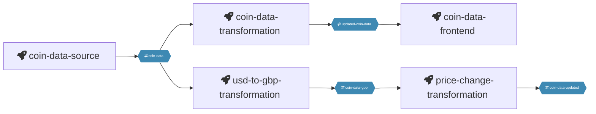

```mermaid
%%{ init: { 'flowchart': { 'curve': 'monotoneX' } } }%%
graph LR;
coin-data-source[fa:fa-rocket coin-data-source &#8205] --> coin-data{{ fa:fa-arrow-right-arrow-left coin-data &#8205}}:::topic;
updated-coin-data{{ fa:fa-arrow-right-arrow-left updated-coin-data &#8205}}:::topic --> coin-data-frontend[fa:fa-rocket coin-data-frontend &#8205];
coin-data{{ fa:fa-arrow-right-arrow-left coin-data &#8205}}:::topic --> usd-to-gbp-transformation[fa:fa-rocket usd-to-gbp-transformation &#8205];
usd-to-gbp-transformation[fa:fa-rocket usd-to-gbp-transformation &#8205] --> coin-data-gbp{{ fa:fa-arrow-right-arrow-left coin-data-gbp &#8205}}:::topic;
coin-data-gbp{{ fa:fa-arrow-right-arrow-left coin-data-gbp &#8205}}:::topic --> price-change-transformation[fa:fa-rocket price-change-transformation &#8205];
price-change-transformation[fa:fa-rocket price-change-transformation &#8205] --> coin-data-updated{{ fa:fa-arrow-right-arrow-left coin-data-updated &#8205}}:::topic;
coin-data{{ fa:fa-arrow-right-arrow-left coin-data &#8205}}:::topic --> coin-data-transformation[fa:fa-rocket coin-data-transformation &#8205];
coin-data-transformation[fa:fa-rocket coin-data-transformation &#8205] --> updated-coin-data{{ fa:fa-arrow-right-arrow-left updated-coin-data &#8205}}:::topic;


classDef default font-size:110%;
classDef topic font-size:80%;
classDef topic fill:#3E89B3;
classDef topic stroke:#3E89B3;
classDef topic color:white;
```